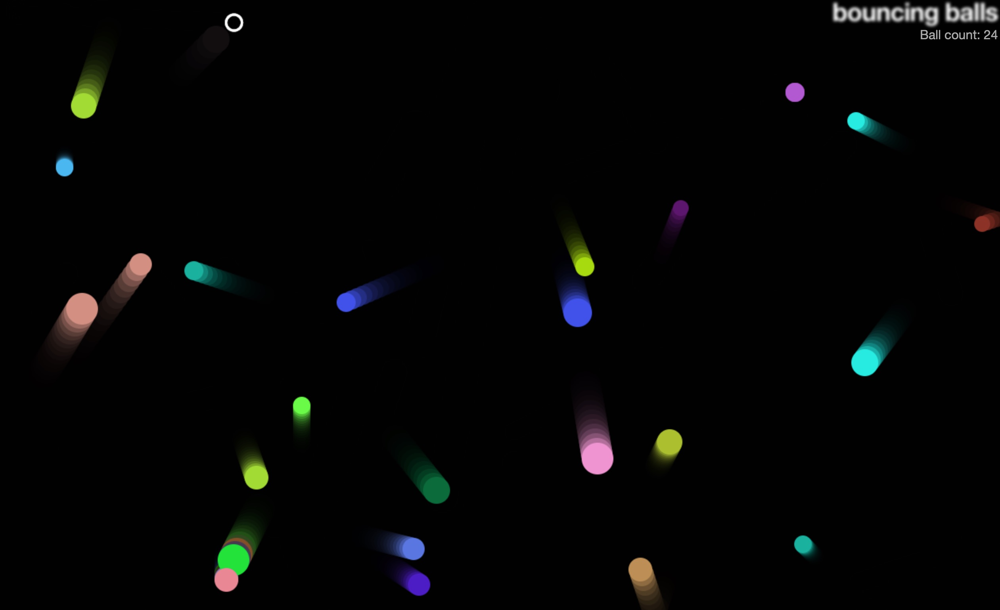

# Bouncing balls

An improved version of the exercise at MDN's [Object building
practice](https://developer.mozilla.org/en-US/docs/Learn/JavaScript/Objects/Object_building_practice).

[Example](https://fshamakhov.me/bouncing-balls/) that supports mouse and touch
events.